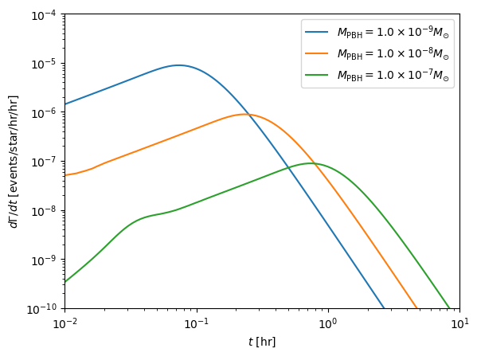
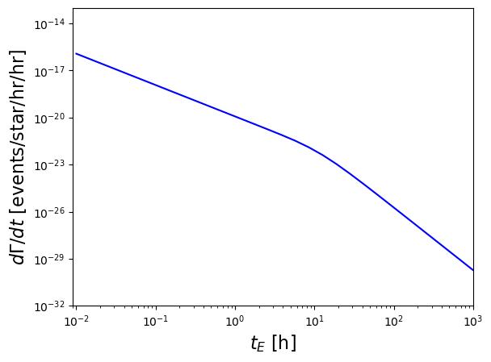

LensCalcPy
================

<!-- WARNING: THIS FILE WAS AUTOGENERATED! DO NOT EDIT! -->

## Install

``` sh
pip install LensCalcPy
```

## How to use

This package is primarily used to calculate the expected rate of
microlensing events for a given population of lenses. At its core, the
package is designed to compute integrals of the form:

$\frac{d\Gamma}{dM\,dd_L\,d\hat{t}\,du_\text{min}} =  \frac{2}{\sqrt{u_T^2 - u_{\rm{min}}^2}} \frac{v_T^4}{v_c^2} \exp \Big[ -\frac{v_T^2}{v_c^2}\Big] n(d_L) f(M) \varepsilon(\hat{t}),$

which is the differential rate for a given line of sight over $d_L$,
mass function $f(M)$, event duration $\hat{t}$, and minimum impact
parameter $u_\text{min}$. In practice, the user can define the
parameters of their survey (Line of sight, cadence, observation
duration) and compute observables such as the distribution of crossing
times $t_E$, total expected events, etc.

For specific examples, see the notebooks in the
[examples](https://github.com/NolanSmyth/LensCalcPy/tree/main/examples)
folder. Below are some minimal examples for PBH (Primordial Black Hole)
lenses and UBO (Unbound Objects) lenses. Here, the line of sight is
towards M31, the Andromeda galaxy.

We can calculate the distribution of crossing times for a given PBH
population

``` python
f_pbh = 1 # fraction of dark matter in PBHs

ts = np.logspace(-2, 1, 20)
pbhs = [Pbh(10**(i), f_pbh, l=l, b=b) for i in np.linspace(-9, -7, 3)]
result = np.zeros((len(pbhs), len(ts)))
for i, pbh in enumerate(pbhs):
    result[i, :] = pbh.compute_differential_rate(ts)
```

``` python
for i, pbh in enumerate(pbhs):
    plt.loglog(ts, result[i], label=r"$M_{\rm{PBH}} = $" + scientific_format(pbh.mass,0) + "$M_{\odot}$")

plt.xlabel(r"$t_E$ [h]", fontsize=16)
plt.ylabel(r"$d\Gamma/dt$ [events/star/hr/hr]", fontsize=16)
plt.xlim(1e-2, 1e1)
plt.ylim(1e-10, 1e-4)

plt.legend()
plt.show()
```



Similarly, we can calculate the distribution of crossing times for an
FFP population with mass function $\frac{dM}{d \log(M)} \propto M^{-p}$

``` python
p = 1
fp = Ffp(p, l=l, b=b)
```

``` python
def differential_rate_mw_mass(m, tcad = 0.07, tobs= 3, finite=True):
    return fp.differential_rate_mw_mass(m, tcad=tcad, tobs=tobs, finite=finite)

m_arr = np.logspace(-15, -3, 20)
with Pool() as pool:
    func = functools.partial(differential_rate_mw_mass, tcad=0.07, tobs=3, finite=True)
    diff_rates  = np.array(list(tqdm(pool.imap(func, m_arr), total=len(m_arr))))
```

    100%|██████████| 20/20 [00:08<00:00,  2.29it/s]

``` python
plt.loglog(m_arr/3e-6, diff_rates, label=r'Finite Source, $t_{\rm{cad}} = 4.2 ~\rm{min}$', color='k')

plt.ylim(1e-24, 1e-9)
plt.xlim(np.min(m_arr)/3e-6, 1e1)

plt.xlabel("Mass [$M_{\oplus}$]")
plt.ylabel(r"$d\Gamma/dM$ [events/star/hr/mass]")
plt.title('MW lens, M31 source')
plt.legend()
plt.show()
```


